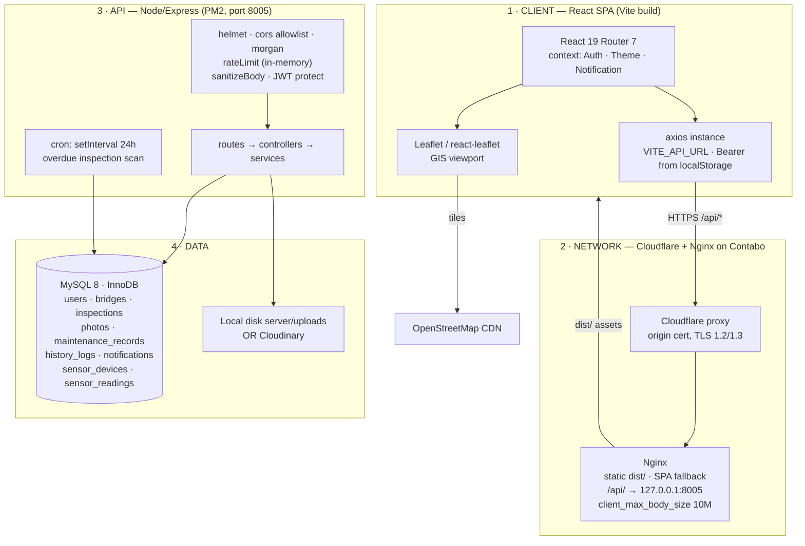

# BMS — Technical Architecture Blueprint & Weakness Register

**System:** Bridge Management System (Bridge Information System)
**Stack:** React 19 + Vite 8 (pure CSS) · Node 18+ / Express 5 · MySQL 8 (mysql2) · Contabo VPS · Nginx · Cloudflare
**Audience:** engineers and technical leads working on this codebase
**Date:** 2026-09-20

This document describes the system as it actually is — every finding below was verified
against the code in this repository, not assumed from the stack description. Where a
concern in the original brief turned out not to exist (SMS delivery, for example), that
is stated plainly rather than answered hypothetically.

---

## 1. Layer blueprint



### 1.1 Client layer

| Concern | Implementation |
|---|---|
| Build | Vite 8, single bundle — **641 KB JS / 180 KB gzip**, 80 KB CSS, no code splitting |
| Routing | `react-router-dom` 7, `PrivateRoute` guard, `adminOnly` variant for `/users` |
| Auth state | JWT + user JSON in `localStorage` (`bis_token`, `bis_user`); `AuthContext` re-validates via `GET /api/auth/me` on mount |
| Session expiry | axios response interceptor: any 401 clears storage and hard-redirects to `/login` |
| Server state | **None.** Each page fetches on mount with `useState`/`useEffect`; no cache, no shared invalidation |
| Styling | Pure CSS, 6 files imported through `src/index.css`, tokens in `src/styles/tokens.css` |

### 1.2 Network / hosting layer

Cloudflare proxies to Nginx on a single Contabo VPS. Nginx serves
`/var/www/bridge-system/dist` with SPA fallback and proxies `/api/` to
`127.0.0.1:8005` with the path preserved. Port 8005 is not publicly reachable.
Express sets `trust proxy: 1`.

### 1.3 API layer

`server.js` boots: MySQL ping → `notificationService.createTables()` → cron start →
`app.listen`. Graceful shutdown on SIGTERM/SIGINT with a 10 s forced-exit timer is
implemented correctly. Layering is clean: `routes → controllers → services → pool`.

Middleware order: helmet → CORS allowlist → morgan → body parsers (10 mb) →
`sanitizeBody` → static `/uploads` → per-route rate limiters → JWT `protect`.

### 1.4 Data layer

InnoDB, utf8mb4, sensible indexes on the core tables, FK cascades from `bridges` to
inspections/photos/maintenance/history, and three triggers that keep
`bridges.current_condition` synchronised with the newest inspection.

---

## 2. Weakness register

Severity: **S1** = data loss, security, or silent failure · **S2** = breaks under growth ·
**S3** = maintainability.

| # | Severity | Area | Finding |
|---|---|---|---|
| 1 | **S1** | Data integrity | Global input sanitiser destroys engineering text containing `<` or `>` |
| 2 | **S1** | Security | `schema.sql` seeds 3 accounts with a published bcrypt hash for the password `password` |
| 3 | **S1** | Silent failure | `notifications` was defined twice with incompatible shapes; every error path swallowed |
| 4 | **S1** | Approvals | Defect sign-off has no idempotency, no self-approval check, no concurrency control |
| 5 | **S1** | Auth | JWT in `localStorage`, no refresh, no revocation, no token version |
| 6 | **S2** | Payload | No pagination anywhere; dashboard loads the entire bridge table twice |
| 7 | **S2** | MySQL | Condition/date filters are applied in JavaScript *after* the query, defeating indexes |
| 8 | **S2** | MySQL | `bridges.current_condition` is maintained by triggers but never read |
| 9 | **S2** | Telemetry | `sensor_readings` grows without bound; no retention or roll-up |
| 10 | **S2** | Rate limit | In-memory limiter store: per-process, resets on restart, multiplies under PM2 cluster |
| 11 | **S2** | GIS | Every marker rendered client-side, no clustering or viewport query |
| 12 | **S2** | Files | Local-mode photo URLs are absolute and stored in the database, pinned to a hostname and port |
| 13 | **S2** | Transactions | Multi-step writes are not atomic; notification and history failures are swallowed |
| 14 | **S2** | Scheduling | Cron is `setInterval` in-process: no persistence, duplicates per PM2 worker, produces no signal |
| 15 | **S2** | Client state | No cache or invalidation; no request cancellation; cross-page staleness |
| 16 | **S3** | Dead code | Duplicate MySQL pool file, duplicate error middleware, 6 unreferenced modules |
| 17 | **S3** | Bundle | 641 KB single chunk; Leaflet, date-fns and two icon sets loaded eagerly |
| 18 | **S3** | Ops | No migration tool, no log rotation, no backup policy in the repo |

---

## 3. Deep dives

### 3.1 The sanitiser corrupts engineering data — S1

`server/middleware/validate.js` runs on **every** request body field:

```js
.replace(/<[^>]*>/g, '')   // strip HTML tags
```

Inspection text is exactly where comparison operators appear. A field containing

> `crack width <2mm, depth >5mm at pier 4`

matches `<2mm, depth >` as a "tag" and is silently stored as

> `crack width 5mm at pier 4`

The measurement is inverted and the defect record is now wrong — with no error and no
way to recover the original. This affects `defectDescription`, `remedy`, `notes`,
`remark` and maintenance `description`.

**Fix:** stop stripping tags on input. Store what the engineer typed and escape on
output — React already escapes everything it renders, so there is no XSS exposure in
the current UI. If a tightened policy is required, restrict it to an allowlist of
fields that are genuinely rendered as HTML (currently: none).

```js
// server/middleware/validate.js — replace sanitizeString with:
function sanitizeString(value) {
  return value.trim();      // escape at render time, never mutate stored engineering text
}
```

### 3.2 Seeded credentials — S1

`server/database/schema.sql` inserts `admin@bms.gov`, `j.banda@bms.gov` and
`m.phiri@bms.gov` with a bcrypt hash whose plaintext (`password`) is written in the
comment directly above it. If that file was ever applied to the production database,
those accounts exist with a known password — and the first is an **ADMIN**.

**Action now:** on production, run
`SELECT id, email, role FROM users WHERE email LIKE '%@bms.gov';` and delete or rotate
anything returned. Then split the seed data into `schema.seed.sql` so applying the
schema never creates accounts.

### 3.3 Notifications: two incompatible table definitions — S1 (fixed this pass)

`schema.sql` created a *per-user* table (`user_id`, `is_read`, ENUM `type`).
`notificationService.createTables()` creates a *shared feed* plus
`notification_reads`, and every query uses the second shape. Both use
`CREATE TABLE IF NOT EXISTS`, so whichever ran first won and the other side broke.

Failure was invisible by construction:

- `createNotification(...).catch(() => {})` in the bridge and inspection controllers
- `catch { /* silent */ }` in `NotificationContext`

so a fresh install had a permanently empty notification bell and no error anywhere.

**Done:** `schema.sql` now defines both tables in the shape the service queries.
**Still required on existing databases:** confirm which shape is live —

```sql
SHOW COLUMNS FROM notifications;         -- expect: type, title, message, entity_type, entity_id
SHOW TABLES LIKE 'notification_reads';   -- expect: one row
```

If the old per-user shape is live, migrate it rather than dropping it (the table may
hold real history). **Also replace the empty catch blocks** — a swallowed error is the
reason this went unnoticed.

### 3.4 Approval / CRUD edge cases — S1

`resolveInspection` in `server/services/inspectionService.js`:

```sql
UPDATE inspections SET is_resolved = 1, resolved_at = NOW(), resolved_by = ? WHERE id = ?
```

Four defects in one statement:

1. **Not idempotent** — re-approving overwrites the original `resolved_at`/`resolved_by`, destroying who signed off first.
2. **No precondition** — an inspection with no recorded defect can be "resolved", and a `DEFECT_RESOLVED` audit entry is written for a non-event.
3. **Self-approval permitted** — the inspector can sign off their own defect; there is no segregation of duties and no role check on the route (`protect` only).
4. **No concurrency control** — two operators approving simultaneously both succeed and both write history.

**Fix** — make the write conditional and the audit truthful:

```sql
UPDATE inspections
SET    is_resolved = 1, resolved_at = NOW(), resolved_by = ?
WHERE  id = ? AND is_resolved = 0 AND defect_description IS NOT NULL;
-- then: if (result.affectedRows === 0) → 409, and log history only when it is 1
```

Add an `approved_by_user_id` column and reject `approver === inspection.user_id` unless
the caller is ADMIN.

### 3.5 Payload bloat and index-defeating filters — S2

`getAllBridges` selects every bridge, with a correlated subquery for the latest
inspection **and** a second subquery counting inspections per row — then filters in
JavaScript:

```js
if (condition) bridges = bridges.filter(b => b.inspections[0]?.conditionStatus === upper);
if (dateFilter) bridges = bridges.filter(...)
```

Consequences at 5,000 bridges: roughly 5 MB of JSON per call, two subqueries per row,
`idx_bridges_current_condition` never used, and pagination impossible because filtering
happens after the result set is built. The dashboard calls this endpoint **and**
`/api/dashboard` on every load; Alerts and Map each call it again.

**Fix, in order:**

1. Read the trigger-maintained column instead of recomputing (finding 3.6) and push the filter into SQL: `WHERE b.current_condition = ?`.
2. Add `LIMIT`/`OFFSET` with a `total` count, and return `{ rows, total, page }`.
3. Give the map a dedicated slim endpoint — `GET /api/bridges/positions` returning only `id, serial_number, northing, easting, current_condition` — instead of the full record set.
4. Cap `getBridgeById`: it currently loads *every* inspection and photo for a structure.

### 3.6 Two sources of truth for condition — S2

The triggers keep `bridges.current_condition` correct on insert, update and delete, and
`idx_bridges_current_condition` exists — but no query reads either. Every condition
figure is recomputed with `LEFT JOIN inspections li ON li.id = (SELECT ... LIMIT 1)`.
The column is therefore untested in production while being the cheaper, indexable
answer. Either use it (preferred — it unlocks 3.5) or drop the column, index and three
triggers. Keeping both is the worst option.

### 3.7 Telemetry growth — S2

One device sampling every 5 minutes produces ~105 k rows/year. A hundred devices at
1-minute resolution is ~52 M rows/year. The schema added this pass is prepared for it —
`BIGINT` key, `(device_id, recorded_at DESC)` composite index, reads clamped to a
window and a row cap — but **no retention job exists**.

Before hardware is connected, pick one:

- **Prune:** delete raw rows older than 90 days, in batches (`LIMIT 10000` in a loop — never one unbounded `DELETE`, which will blow out the undo log and lock the table).
- **Roll up (preferred):** hourly `min/max/avg` per device into `sensor_readings_hourly`, then prune raw. Trend charts read the roll-up; only the live view reads raw.

Also note `getSensorSummary` runs a correlated latest-row subquery per device. That is
index-backed and fine for tens of devices; past a few hundred, denormalise
`latest_reading_id` onto `sensor_devices`.

### 3.8 Rate limiting is not what it appears — S2

`express-rate-limit` with the default memory store means limits are **per process**:
they reset on every deploy, and under `pm2 start -i max` each worker keeps its own
counter, so the effective auth limit is `20 × worker count`. Worse, correctness depends
on `req.ip` being the real client — with `trust proxy: 1` behind Cloudflare *and*
Nginx, this is only right if Nginx sets `X-Forwarded-For` properly. If it does not,
every user shares one bucket (one attacker locks out everyone); if the header is
accepted unvalidated, the limiter is trivially bypassed.

**Fix:** verify `proxy_set_header X-Forwarded-For $proxy_add_x_forwarded_for;` in the
Bridge Nginx block, set `trust proxy` to the actual hop count, prefer Cloudflare's
`CF-Connecting-IP`, and move the store to Redis (or accept single-process PM2 and
document it).

### 3.9 Image storage constraints — S2

In `local` mode `photoController` builds and **stores** an absolute URL:

```js
photoUrl = `${mediaBase()}/uploads/${req.file.filename}`;   // SERVER_URL + path
```

With `SERVER_URL=https://bridge.<host>:8005`, three problems compound: port 8005 is not
publicly reachable through Cloudflare (which proxies only standard ports); the
hostname is frozen into every row, so a domain migration silently breaks historical
images; and `/uploads/*.jpg` returns an Nginx 404 on the live site, suggesting no
`location /uploads/` block exists at all.

Additional constraints: the unique key `(bridge_id, photo_type)` caps a structure at
**two** photos ever; `photos.inspection_id` and `uploaded_by` are never populated, so
imagery cannot be tied to the inspection that produced it; uploads are written to the
app directory, which a redeploy can wipe and which no backup covers.

**Fix:** store a **relative** path (`/uploads/<file>`) and resolve the origin at render
time; serve `/uploads/` from Nginx directly; move the directory outside the deploy tree
(e.g. `/var/lib/bms/uploads`) or commit to Cloudinary for all environments; populate
`inspection_id`/`uploaded_by`; drop the two-photo unique key in favour of
`(bridge_id, inspection_id, sort_order)`.

### 3.10 No transactions, and swallowed failures — S2

`createInspection` inserts the inspection, then writes history, then fires a
notification — three independent statements. A crash between them leaves an inspection
with no audit entry. `logHistory` catches and logs to stdout; `createNotification` is
called without `await` and with an empty catch. The audit trail is therefore
best-effort while being the thing an audit would rely on.

**Fix:** wrap inspection-plus-history in a single transaction
(`conn.beginTransaction()` on a dedicated connection); keep notifications outside it,
but route them through a persisted outbox row rather than a fire-and-forget promise.

### 3.11 Scheduling and notification routing — S2

The brief asked about "unhandled SMS/notification routing timeouts". To be accurate:
**there is no SMS, email, or any outbound delivery channel in this system.** No
provider SDK, no credentials, no queue. Notifications are database rows read by the
bell in the top bar. There is consequently nothing that can time out — and equally, no
alert reaches anyone who is not looking at the dashboard.

What does exist is weaker than it looks. `cron/inspectionReminderJob.js` uses
`setInterval(24h)` inside the API process, which means:

- the schedule restarts on every deploy, so a daily job can effectively never run on a frequently-deployed server;
- under PM2 cluster mode every worker runs its own copy;
- nothing is persisted, so a missed window is simply lost;
- and critically, **it only calls `logger.warn`** — it writes no notification and sends nothing. Overdue structures are announced to a log file.

**Fix:** have the job call `createNotification` so overdue inspections surface in the UI
(the Alerts page already computes this independently client-side). Move scheduling to
`node-cron` guarded to one instance, or to a system-level cron calling a one-shot
script. When a delivery channel is added, put it behind an outbox table with explicit
`status`, `attempts`, `next_attempt_at` and an idempotency key, with timeouts and
capped exponential backoff on the provider call — that is where the timeout handling
the brief anticipated actually belongs.

### 3.12 Client/server state synchronisation — S2

There is no server-state library. Every page owns its fetch, so:

- **Cross-page staleness** — approving a defect on Alerts does not update the Dashboard KPI; each screen re-derives its own truth on mount.
- **No cancellation** — no `AbortController`; navigating quickly lets a slow earlier response overwrite newer state.
- **Optimistic writes then full reload** — the dashboard mutates local state, then refetches everything, doubling load on the heaviest endpoint.
- **Effect-driven fetching** — `react-hooks/set-state-in-effect` fires on 12 call sites (8 pre-existing, 4 added by the new pages, following the established pattern). It is a real cascading-render smell, and the correct fix is one layer, not 12 patches.
- `localStorage.bis_user` can drift from server truth between mounts; a role change mid-session is only picked up on reload.

**Fix:** adopTanStack Query (or SWR) with query keys per resource, `staleTime` tuned
per endpoint, and invalidation on mutation. One dependency removes the staleness, the
races, the duplicate fetching, and the lint class in a single pass.

### 3.13 Dead code and duplication — S3

| File | Status |
|---|---|
| `server/config/db.js` | Byte-identical duplicate of `config/database.js`. Nothing imports it — but if anything ever does, the app runs **two** 10-connection pools |
| `server/middleware/errorMiddleware.js` | Unused duplicate of `errorHandler.js` with drifted messages |
| `src/components/dashboard/ConditionChart.jsx`, `StatsCard.jsx` | Unreferenced (dashboard now uses `KpiBlock`/`PieChart`) |
| `src/components/ui/EmptyState.jsx`, `Loader.jsx` | Unreferenced |
| `src/hooks/useFetch.js` | Unreferenced; also has a non-literal dependency array |
| `src/services/api.js` | Re-export barrel nothing imports |

Delete the two server duplicates now — they are a correctness trap, not just clutter.

### 3.14 Bundle and delivery — S3

641 KB in one chunk. Leaflet, `date-fns`, and both `react-icons` sets (Fi and Md) load
before the login screen paints.

**Fix:** `React.lazy` per route (the map and sensor pages are the expensive ones),
import only the icon modules used, and let Vite split vendor chunks. Realistic target
is a ~150 KB initial chunk.

---

## 4. Remediation backlog

**P0 — this week**

1. Remove the tag-stripping sanitiser (§3.1) and audit existing rows for corrupted measurements.
2. Check production for the seeded `@bms.gov` accounts and rotate or delete them (§3.2).
3. Verify the live `notifications` shape; replace the empty catch blocks (§3.3).
4. Make defect approval conditional, idempotent and non-self-approvable (§3.4).

**P1 — next sprint**

5. Pagination plus SQL-side filtering on `current_condition`; slim `/positions` endpoint for the map (§3.5, §3.6).
6. Verify the Nginx `X-Forwarded-For` chain; move the rate-limit store to Redis (§3.8).
7. Relative photo paths, Nginx-served `/uploads/`, storage outside the deploy tree (§3.9).
8. Transaction around inspection + history; notification outbox (§3.10).
9. Reminder job writes notifications; move to `node-cron` single-instance (§3.11).

**P2 — hardening**

10. TanStack Query for all server state (§3.12).
11. Sensor retention/roll-up job before hardware connects (§3.7).
12. Marker clustering or viewport-bounded GIS queries (§3.11 table row).
13. Route-level code splitting (§3.14).
14. Delete duplicate pool and error middleware; prune unreferenced modules (§3.13).
15. Introduce a migration runner (the `migrations/` directory now exists but is applied by hand), log rotation for morgan, and a documented MySQL backup schedule.

---

## 5. What changed in this pass

**Design system (new):** `src/styles/{tokens,base,components,layout,dashboard,modules}.css`,
imported via `src/index.css`. Navy `#0F172A` structural surfaces, safety orange
`#F97316` reserved for primary actions and critical state, backgrounds `#F8FAFC`, text
`#334155`, radii capped at 2–6 px, Inter + JetBrains Mono (measurements, coordinates
and IDs are set in tabular mono). Full light and dark palettes; `variables.css` removed.

**Layout:** sidebar rebuilt into three functional groups (Operations, Monitoring,
Administration) with a live signal count; topbar reworked with per-route titles for the
new sections.

**Dashboard:** Section A — four KPI blocks (Total Monitored Bridges, Critical
Maintenance Alerts, Inspected This Quarter, Structural Health Index). Section B — GIS
hub on real coordinates with green/amber/red/grey pins, auto-fit bounds, a legend
carrying live counts, a portfolio panel and a critical watchlist. Section C — operations
table with Bridge ID/Name, Region/Location, Material Type, Last Inspection, Condition
Rating, and working **Approve** (defect sign-off) and **Hard Delete** actions.

**Structural Health Index:** defined in `dashboardService.js` as a weighted mean of
inspected structures — GOOD 100, FAIR 60, POOR 20. Uninspected structures are
**excluded** from the average and reported separately as `coverage`, so the figure
cannot silently flatter a portfolio that has barely been inspected.

**Backend added:** maintenance module (`/api/maintenance`) over the existing
`maintenance_records` table — previously the table had no API at all; sensor module
(`/api/sensors`) with new `sensor_devices` / `sensor_readings` tables, threshold
classification at write time, and alarm notifications raised on threshold *crossing*
rather than on every breaching sample. `/api/dashboard` gained health index, quarter
throughput, overdue counts and module summaries — all additive, existing fields
untouched. `bridge_name` and `construction_year` are now readable and writable
(the columns existed in MySQL but no endpoint exposed them).

**Degradation:** dashboard module summaries and both new pages detect a missing table
and say so, pointing at the migration, instead of erroring or rendering zeros as fact.

**Migration:** `server/database/migrations/001_sensor_telemetry.sql` — additive only,
re-runnable, never alters or drops an existing table.

**Verification:** production build succeeds (467 modules, 641 KB JS / 80 KB CSS);
backend files pass `node --check`; ESLint 19 findings against a 17 baseline — the two
genuine issues introduced were fixed, the remaining delta is the pre-existing
fetch-in-effect pattern (§3.12).

**Not verified:** nothing was run against a live database or browser in this pass. The
migration has not been applied, and no deployment was performed.
